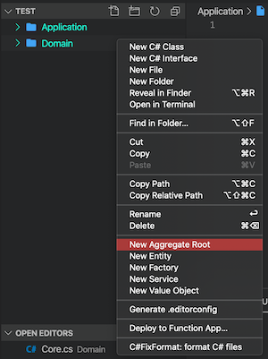

# Clean Architecture C# Extension for Visual Studio Code

C# extension to guide you into implementing a software following the Clean Architecture principles. It helps with the project structure, design patterns, dependencies and using frameworks correctly.

## Install

You can install [Clean Architecture C# Snippets](https://marketplace.visualstudio.com/items?itemName=ivanpaulovich.clean-architecture-csharp-snippets) from the Visual Studio Code Marketplace.

## Index of Features
  
* [Domain](#domain)
  * [New Aggregate Root](#new-aggregate-root)
  * [New Entity](#new-entity)
  * [New Value Object](#new-value-object)
  * [New Domain Service](#new-domain-service)
  * [New Factory](#new-factory)
* [Application](#application)
  * [Add Boundaries](#add-boundaries)
  * [New Use Case](#new-use-case)
* [Roadmap](#roadmap)

## Domain

Create a folder name `Domain` then right click on it for the following options.

### New Aggregate Root

Type the Aggregate Root name and press `enter`. The following files will be created:

* Aggregate Root abstract class.
* Aggregate Root interface.
* Aggregate Root Repository interface.

### New Entity

Type the Entity name and press `enter`. The following files will be created:

* Aggregate Root abstract class.
* Aggregate Root interface.

### New Value Object

Type the Value Object name and press `enter`. The following file will be created:

* Value Object struct.

### New Service

Type the Domain Service name and press `enter`. The following file will be created:

* Sealed domain service class.

### New Factory

Type the Factory name and press `enter`. The following file will be created:

* Factory interface.

## Application

Create a folder name `Application` then right click on it for the following options.

### Add Boundaries

The following files will be created:

* Use Case Interface.
* Use Case Standard Output Port interface.
* Use Case Error Output Port interface.
* Use Case Not Found Output Port interface.

### New Use Case

The following files will be created:

* Use Case implementation.
* Use Case boundary.

## Roadmap

* [x] Add initial context menu options.
* [ ] Link templates to Clean Architecture Manga wiki.
* [ ] Add fine grained code snippets.
* [ ] Add more context menu options.
* [ ] Code analyzers.
* [ ] Add common dependencies.
* [ ] Generate solution structure.
* [ ] Add tools for infrastructure.
* [ ] Add tools for user interface.

> Features are released quickly. Check out the [Changelog](https://github.com/ivanpaulovich/CleanArchitectureVSCodeSnippets/blob/master/CHANGELOG.md) and give a :star:!